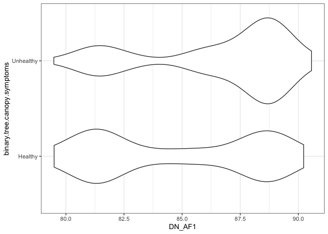
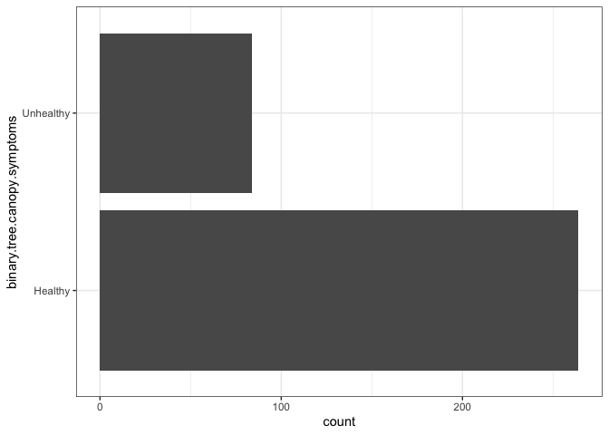
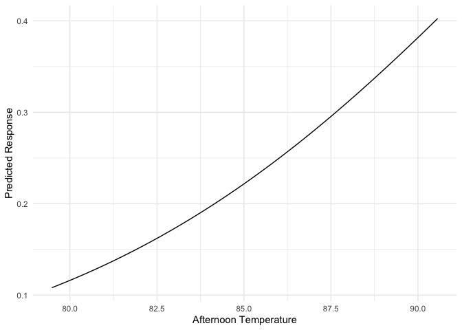
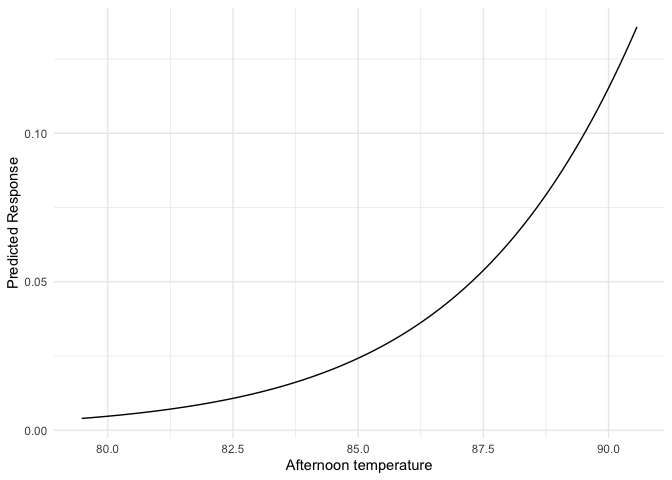
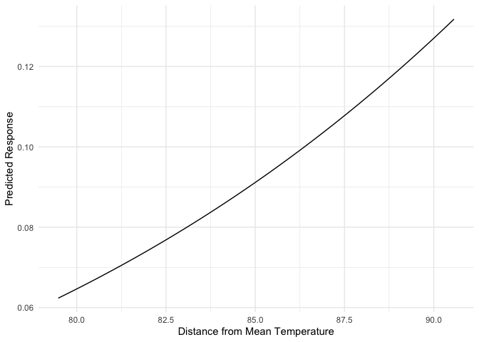

|            |            |            |            |
|:----------:|:----------:|:----------:|:----------:|
|[Welcome](https://jmhulbert.github.io/redhot)|[Data](https://jmhulbert.github.io/redhot/data)|[Analyses](https://jmhulbert.github.io/redhot/analyses)|[Discussion](https://jmhulbert.github.io/redcedar/discussion)|
|             |           |            |            |


```r
library(tidyverse)
library(corrplot)
library(knitr)
library(kableExtra)
library(gghalves)
library(patchwork)
library(scales)
library(glmmTMB)
library(bbmle)
library(DHARMa)
```


# Purpose

The purpose of this page is to summarize an investigation of **tree health categories** as a *categorical* response to urban heat (temperatures).

Response variable: category: *healthy, unhealthy*


# Read Data


```r
data <- read.csv('https://raw.githubusercontent.com/jmhulbert/redhot/main/data/urban-data-modified.csv')
```

# Wrangle Data

## Remove dead trees


```r
# Remove Dead Trees
data.w.dead <- data 
data <- data %>% filter(field.tree.canopy.symptoms!="Tree is dead") %>% filter(field.dieback.percent<100) %>% droplevels()
```


```r
data$binary.tree.canopy.symptoms <- as.factor(data$binary.tree.canopy.symptoms)
levels(data$binary.tree.canopy.symptoms)
```

```
## [1] "Healthy"   "Unhealthy"
```


## Filter to Portland Data


## Observations from Hoyt


```r
hoyt.data <- data %>% filter(str_detect(place_guess, "Hoyt") |str_detect(place_guess, "hoyt"))
```


## Remove observations from Hoyt


```r
data <- data %>% filter(!str_detect(place_guess, "Hoyt") & !str_detect(place_guess, "hoyt"))
```


```r
data <- data %>% filter(Area=="Portland") %>% droplevels()
```


```r
ggplot(data,aes(binary.tree.canopy.symptoms,DN_AF1))+geom_violin()+coord_flip()+theme_bw()
```

<!-- -->


```r
ggplot(data,aes(binary.tree.canopy.symptoms))+geom_histogram(stat="count")+theme_bw()+coord_flip()
```

```
## Warning in geom_histogram(stat = "count"): Ignoring unknown parameters:
## `binwidth`, `bins`, and `pad`
```

<!-- -->


```r
ggplot(data,aes(reclassified.tree.canopy.symptoms))+geom_histogram(stat="count")+theme_bw()+coord_flip()
```

```
## Warning in geom_histogram(stat = "count"): Ignoring unknown parameters:
## `binwidth`, `bins`, and `pad`
```

<!-- -->


```r
data$top.dieback <- as.factor(data$top.dieback)
data$thinning <- as.factor(data$thinning)
```


# Analyses

## Fit Models
 
### Portland data with heat values cacluated before removing hoyt


```r
binomial.daily <- glmmTMB(binary.tree.canopy.symptoms ~ mean.temp.daily ,family=binomial,data=data)
binomial.am <- glmmTMB(binary.tree.canopy.symptoms ~ DN_AM1 ,data=data,family=binomial)
binomial.af <- glmmTMB(binary.tree.canopy.symptoms ~ DN_AF1 ,data=data,family=binomial)
binomial.pm <- glmmTMB(binary.tree.canopy.symptoms ~ DN_PM1,data=data,family=binomial)
```

## Compare Models


```r
AICtab(binomial.daily,binomial.am,binomial.af,binomial.pm)
```

```
##                dAIC df
## binomial.af     0.0 2 
## binomial.daily  9.2 2 
## binomial.pm    16.3 2 
## binomial.am    16.6 2
```

Afternoon heat was the best fit


## Model 1: health and heat


```r
#binomial.af <- glmmTMB(binary.tree.canopy.symptoms ~ dist.from.mean.af,data=data,family=binomial)
```


### Summary


```r
summary(binomial.af)
```

```
##  Family: binomial  ( logit )
## Formula:          binary.tree.canopy.symptoms ~ DN_AF1
## Data: data
## 
##      AIC      BIC   logLik deviance df.resid 
##    371.4    379.1   -183.7    367.4      346 
## 
## 
## Conditional model:
##             Estimate Std. Error z value Pr(>|z|)    
## (Intercept) -14.4032     3.3726  -4.271 1.95e-05 ***
## DN_AF1        0.1547     0.0391   3.956 7.61e-05 ***
## ---
## Signif. codes:  0 '***' 0.001 '**' 0.01 '*' 0.05 '.' 0.1 ' ' 1
```

Tree health is associated with urban heat. The probability of success (tree categorized as unhealthy) increases with urban heat

Unhealthy trees are considered success (1) because it is the second level. The probability of failure (0) is the first level (Healthy).


```r
levels(data$binary.tree.canopy.symptoms)
```

```
## [1] "Healthy"   "Unhealthy"
```

The probability of a tree being classified as unhealthy increases with urban temperature. 


### Visualize effects of predictors

First, generate predictions from model


```r
# Create a data frame for predictions
new.data <- expand.grid(
  DN_AF1 = seq(min(data$DN_AF1), max(data$DN_AF1), length.out = 100),  # keeping predictor2 constant at its mean
  Area = 0  # assuming random effect is zero for prediction
)
```


```r
new.data$predicted_response <- predict(binomial.af, newdata = new.data, type = "response")
```


```r
ggplot(new.data, aes(x = DN_AF1, y = predicted_response)) +
  geom_line() +
  labs(x = "Afternoon Temperature", y = "Predicted Response") +
  theme_minimal()
```

<!-- -->

The probability of tree being classified as unhealthy increases with afternoon temperature

## Model 2: top dieback and heat


```r
top.dieback.binomial.af <- glmmTMB(top.dieback ~ DN_AF1,data=data,family=binomial)
```

### Summary


```r
summary(top.dieback.binomial.af)
```

```
##  Family: binomial  ( logit )
## Formula:          top.dieback ~ DN_AF1
## Data: data
## 
##      AIC      BIC   logLik deviance df.resid 
##    116.0    123.7    -56.0    112.0      346 
## 
## 
## Conditional model:
##             Estimate Std. Error z value Pr(>|z|)   
## (Intercept) -31.8613    10.9045  -2.922  0.00348 **
## DN_AF1        0.3314     0.1239   2.675  0.00748 **
## ---
## Signif. codes:  0 '***' 0.001 '**' 0.01 '*' 0.05 '.' 0.1 ' ' 1
```


```r
levels(data$top.dieback)
```

```
## [1] "No"  "Yes"
```

The probability of a tree having top dieback increases with urban temperature. 

### Visualize effects of predictors

First, generate predictions from model


```r
# Create a data frame for predictions
new.data.2 <- expand.grid(
  DN_AF1 = seq(min(data$DN_AF1), max(data$DN_AF1), length.out = 100),  # keeping predictor2 constant at its mean
  Area = 0  # assuming random effect is zero for prediction
)
```


```r
new.data.2$predicted_response <- predict(top.dieback.binomial.af, newdata = new.data.2, type = "response")
```


```r
ggplot(new.data.2, aes(x = DN_AF1, y = predicted_response)) +
  geom_line() +
  labs(x = "Afternoon temperature", y = "Predicted Response") +
  theme_minimal()
```

<!-- -->

The probability of a tree having top dieback increases with afternoon temperature

## Model 3: thinning and heat


```r
thinning.binomial.af <- glmmTMB(thinning ~ DN_AF1,data=data,family=binomial)
```

### Summary


```r
summary(thinning.binomial.af)
```

```
##  Family: binomial  ( logit )
## Formula:          thinning ~ DN_AF1
## Data: data
## 
##      AIC      BIC   logLik deviance df.resid 
##    220.3    228.0   -108.1    216.3      346 
## 
## 
## Conditional model:
##             Estimate Std. Error z value Pr(>|z|)  
## (Intercept) -8.62954    4.64334  -1.858   0.0631 .
## DN_AF1       0.07447    0.05397   1.380   0.1676  
## ---
## Signif. codes:  0 '***' 0.001 '**' 0.01 '*' 0.05 '.' 0.1 ' ' 1
```


```r
levels(data$thinning)
```

```
## [1] "No"  "Yes"
```

There is no evidence the probability of a tree being classified as thinning is related to afternoon heat.  

### Visualize effects of predictors

First, generate predictions from model


```r
# Create a data frame for predictions
new.data.3 <- expand.grid(
  DN_AF1 = seq(min(data$DN_AF1), max(data$DN_AF1), length.out = 100),  # keeping predictor2 constant at its mean
  Area = 0  # assuming random effect is zero for prediction
)
```


```r
new.data.3$predicted_response <- predict(thinning.binomial.af, newdata = new.data.3, type = "response")
```


```r
ggplot(new.data.3, aes(x = DN_AF1, y = predicted_response)) +
  geom_line() +
  labs(x = "Distance from Mean Temperature", y = "Predicted Response") +
  theme_minimal()
```

<!-- -->


## Compare Models

### Odds Ratios

Unhealthy Trees


```r
# Unhealthy Overall
coef(binomial.af)
```

```
## list()
```

```r
exp(0.1546759)
```

```
## [1] 1.16728
```

Top Dieback


```r
# Top Dieback
coef(top.dieback.binomial.af)
```

```
## list()
```

```r
exp(0.3313664)
```

```
## [1] 1.39287
```


