|            |            |            |            |            |
|:----------:|:----------:|:----------:|:----------:|:----------:|
|[Welcome](https://jmhulbert.github.io/redhot)|[Data](https://jmhulbert.github.io/redhot/data)|[Analyses](https://jmhulbert.github.io/redhot/analyses)|[Discussion](https://jmhulbert.github.io/redhot/discussion)|[Maps](https://jmhulbert.github.io/redhot/maps)
|             |           |            |            |            |


``` r
library(tidyverse)
library(knitr)
library(kableExtra)
library(gghalves)
library(patchwork)
library(scales)
library(ggmap)
library(osmdata)
```


# Purpose

The purpose of this page is to generate maps of data used in analyses. 


# Read Data


``` r
data <- read.csv('https://raw.githubusercontent.com/jmhulbert/redhot/main/data/urban-data-modified.csv')
```

# Filter into Areas


``` r
portland <- data %>% filter(Area=="Portland")
king <- data %>% filter(Area=="King County")
tacoma <-data %>% filter(Area=="Tacoma")
```


## Portland


``` r
portbb <- c(left = min(portland$longitude.x), 
                              bottom = min(portland$latitude.x), 
                              right = max(portland$longitude.x), 
                              top = max(portland$latitude.x))
```


``` r
portmap <- get_map(portbb, zoom = 11, scale = 2, maptype="terrain",source="google")
```

```
## ! Bounding box given to Google - spatial extent only approximate.
```

```
## ℹ <https://maps.googleapis.com/maps/api/staticmap?center=45.552374,-122.637458&zoom=11&size=640x640&scale=2&maptype=terrain&language=en-EN&key=xxx>
```

``` r
portland.map <- ggmap(portmap) + geom_point(data = portland, aes(x = longitude.x, y = latitude.x,fill=DN_AF1), color = "black",pch=21, size = 3) + theme_minimal() +scale_fill_viridis_c(option = "inferno")+labs(title="Portland",x="Longitude",y="Latitude",fill="Afternoon\nTemp (F)") +theme(plot.title = element_text(size = 14, hjust = .5,face = "bold.italic"))
```


``` r
portland.map
```

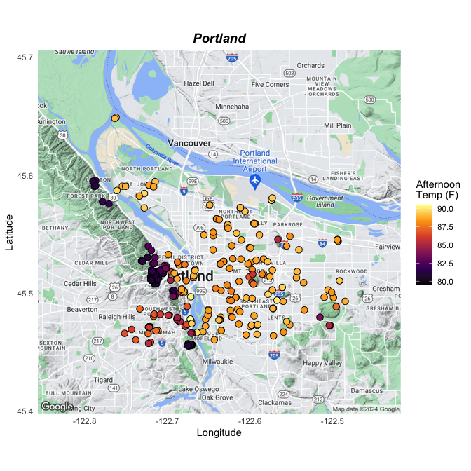<!-- -->

## King County


``` r
kingbb <- c(left = min(king$longitude.x), 
                              bottom = min(king$latitude.x), 
                              right = max(king$longitude.x), 
                              top = max(king$latitude.x))
```


``` r
kingmap <- get_map(kingbb, zoom = 10, scale = 2,maptype="terrain",source="google")
```

```
## ! Bounding box given to Google - spatial extent only approximate.
```

```
## ℹ <https://maps.googleapis.com/maps/api/staticmap?center=47.521806,-122.07004&zoom=10&size=640x640&scale=2&maptype=terrain&language=en-EN&key=xxx>
```


``` r
king.map <- ggmap(kingmap) + geom_point(data = king, aes(x = longitude.x, y = latitude.x,fill=DN_AF1), color = "black",pch=21, size = 3) + theme_minimal() +scale_fill_viridis_c(option = "inferno")+labs(title="King County",x="Longitude",y="Latitude",fill="Afternoon\nTemp (F)") +theme(plot.title = element_text(size = 14, hjust = .5,face = "bold.italic"))
```


``` r
king.map
```

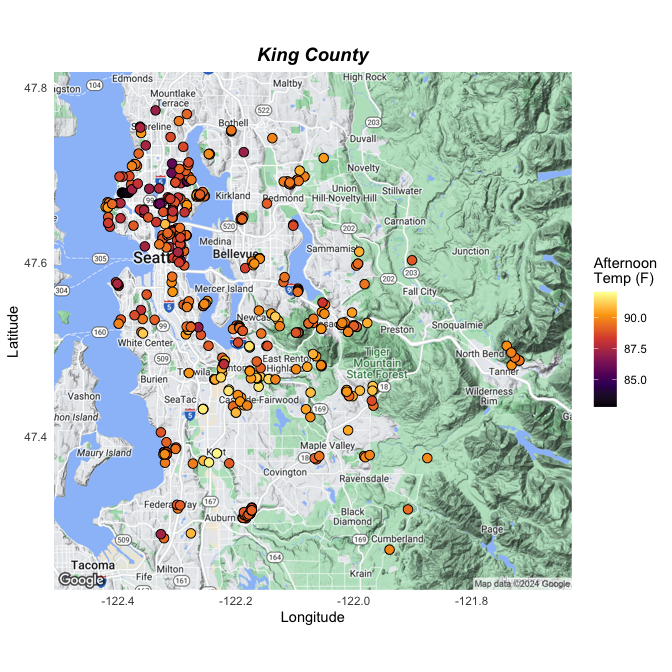<!-- -->


## Tacoma


``` r
tacomabb <- c(left = min(tacoma$longitude.x), 
                              bottom = min(tacoma$latitude.x), 
                              right = max(tacoma$longitude.x), 
                              top = max(tacoma$latitude.x))
```


``` r
tacomamap <- get_map(tacomabb, zoom = 12, scale = 2,maptype="terrain",source="google")
```

```
## ! Bounding box given to Google - spatial extent only approximate.
```

```
## ℹ <https://maps.googleapis.com/maps/api/staticmap?center=47.248009,-122.474169&zoom=12&size=640x640&scale=2&maptype=terrain&language=en-EN&key=xxx>
```


``` r
tacoma.map <- ggmap(tacomamap) + geom_point(data = tacoma, aes(x = longitude.x, y = latitude.x,fill=DN_AF1), color = "black",pch=21, size = 3) + theme_minimal() +scale_fill_viridis_c(option = "inferno")+labs(title="Tacoma",x="Longitude",y="Latitude",fill="Afternoon\nTemp (F)") +theme(plot.title = element_text(size = 14, hjust = .5,face = "bold.italic"))
```


``` r
tacoma.map
```

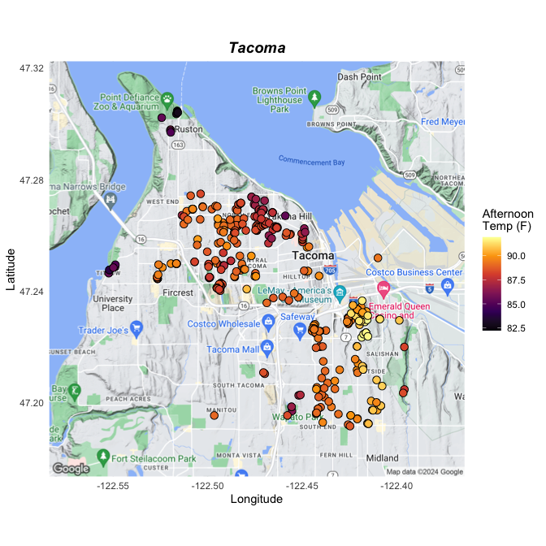<!-- -->


``` r
portland.map <- portland.map + theme(legend.position = "none")
tacoma.map <- tacoma.map + theme(legend.position = "none")
king.map <- king.map
```


``` r
portland.map + tacoma.map + king.map
```

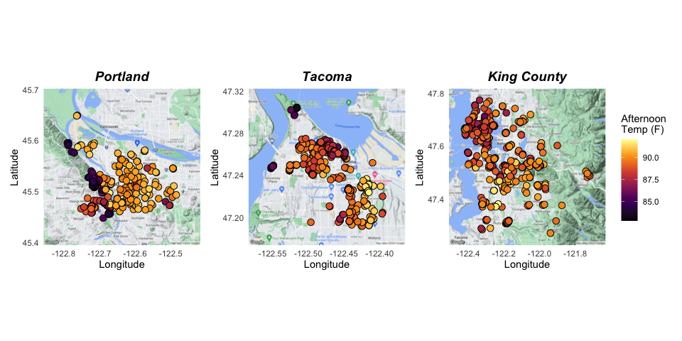<!-- -->


# Trees with Dead Tops


``` r
portland.dead.top <- portland %>% filter(top.dieback=="Yes")
tacoma.dead.top <- tacoma %>% filter(top.dieback=="Yes")
king.dead.top <- king %>% filter(top.dieback=="Yes")
```


## Portland


``` r
portland.dead.top.map <- ggmap(portmap) + geom_point(data = portland.dead.top, aes(x = longitude.x, y = latitude.x,fill=DN_AF1), color = "black",pch=21, size = 3) + theme_minimal() +scale_fill_viridis_c(option = "inferno")+labs(title="Portland",x="Longitude",y="Latitude",fill="Afternoon\nTemp (F)") +theme(plot.title = element_text(size = 14, hjust = .5,face = "bold.italic"))
```


``` r
portland.dead.top.map
```

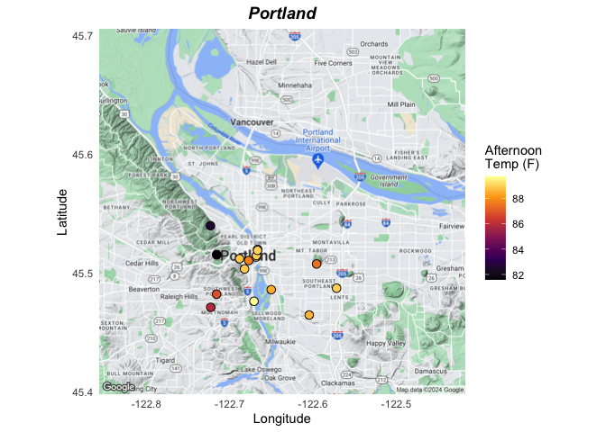<!-- -->

## King County


``` r
king.dead.top.map <- ggmap(kingmap) + geom_point(data = king.dead.top, aes(x = longitude.x, y = latitude.x,fill=DN_AF1), color = "black",pch=21, size = 3) + theme_minimal() +scale_fill_viridis_c(option = "inferno")+labs(title="King County",x="Longitude",y="Latitude",fill="Afternoon\nTemp (F)") +theme(plot.title = element_text(size = 14, hjust = .5,face = "bold.italic"))
```


``` r
king.dead.top.map
```

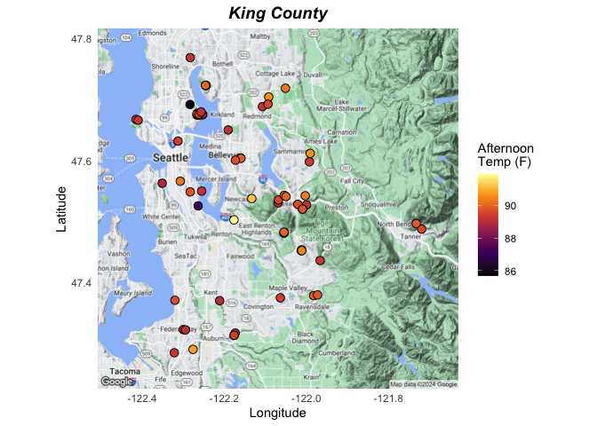<!-- -->

## Tacoma


``` r
tacoma.dead.top.map <- ggmap(tacomamap) + geom_point(data = tacoma.dead.top, aes(x = longitude.x, y = latitude.x,fill=DN_AF1), color = "black",pch=21, size = 3) + theme_minimal() +scale_fill_viridis_c(option = "inferno")+labs(title="Tacoma",x="Longitude",y="Latitude",fill="Afternoon\nTemp (F)") +theme(plot.title = element_text(size = 14, hjust = .5,face = "bold.italic"))
```


``` r
tacoma.dead.top.map
```

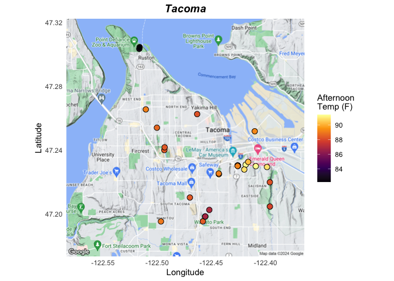<!-- -->


``` r
portland.dead.top.map <- portland.dead.top.map + theme(legend.position = "none")
tacoma.dead.top.map <- tacoma.dead.top.map + theme(legend.position = "none")
king.dead.top.map <- king.dead.top.map
```


``` r
portland.dead.top.map + tacoma.dead.top.map + king.dead.top.map
```

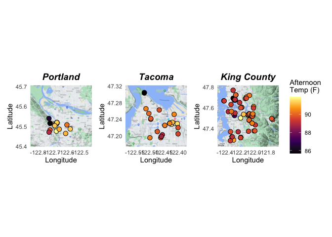<!-- -->


# Trees with Thinning Canopies


``` r
portland.thinning <- portland %>% filter(thinning=="Yes")
tacoma.thinning <- tacoma %>% filter(thinning=="Yes")
king.thinning <- king %>% filter(thinning=="Yes")
```


## Portland


``` r
portland.thinning.map <- ggmap(portmap) + geom_point(data = portland.thinning, aes(x = longitude.x, y = latitude.x,fill=DN_AF1), color = "black",pch=21, size = 3) + theme_minimal() +scale_fill_viridis_c(option = "inferno")+labs(title="Portland",x="Longitude",y="Latitude",fill="Afternoon\nTemp (F)") +theme(plot.title = element_text(size = 14, hjust = .5,face = "bold.italic"))
```


``` r
portland.thinning.map
```

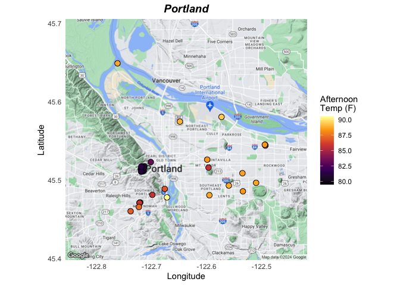<!-- -->

## King County


``` r
king.thinning.map <- ggmap(kingmap) + geom_point(data = king.thinning, aes(x = longitude.x, y = latitude.x,fill=DN_AF1), color = "black",pch=21, size = 3) + theme_minimal() +scale_fill_viridis_c(option = "inferno")+labs(title="King County",x="Longitude",y="Latitude",fill="Afternoon\nTemp (F)") +theme(plot.title = element_text(size = 14, hjust = .5,face = "bold.italic"))
```


``` r
king.thinning.map
```

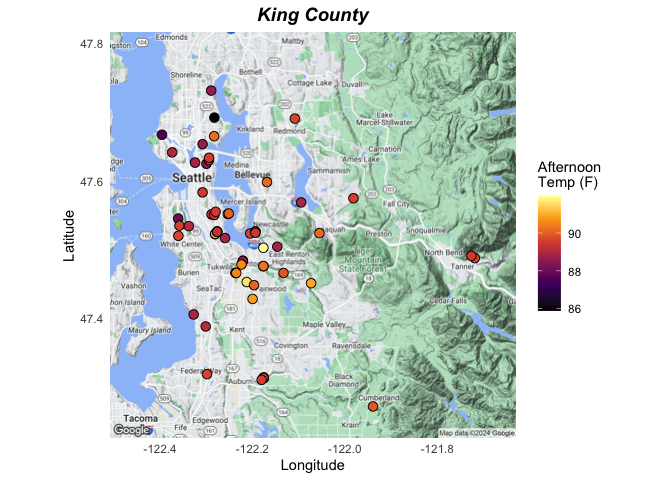<!-- -->

## Tacoma


``` r
tacoma.thinning.map <- ggmap(tacomamap) + geom_point(data = tacoma.thinning, aes(x = longitude.x, y = latitude.x,fill=DN_AF1), color = "black",pch=21, size = 3) + theme_minimal() +scale_fill_viridis_c(option = "inferno")+labs(title="Tacoma",x="Longitude",y="Latitude",fill="Afternoon\nTemp (F)") +theme(plot.title = element_text(size = 14, hjust = .5,face = "bold.italic"))
```


``` r
tacoma.thinning.map
```

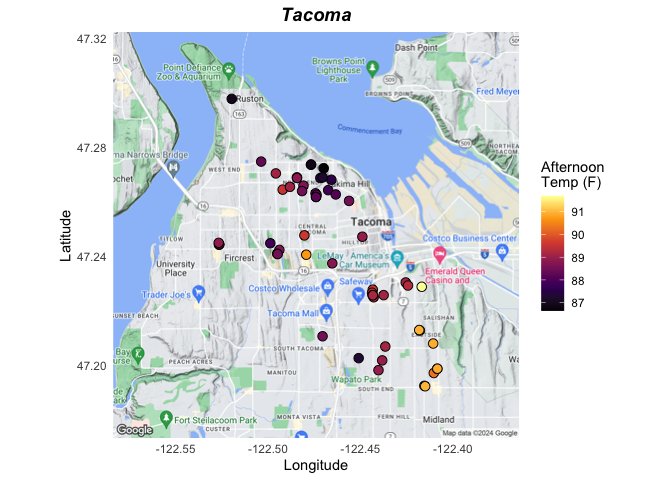<!-- -->


``` r
portland.thinning.map <- portland.thinning.map + theme(legend.position = "none")
tacoma.thinning.map <- tacoma.thinning.map + theme(legend.position = "none")
king.thinning.map <- king.thinning.map
```


``` r
portland.thinning.map + tacoma.thinning.map + king.thinning.map
```

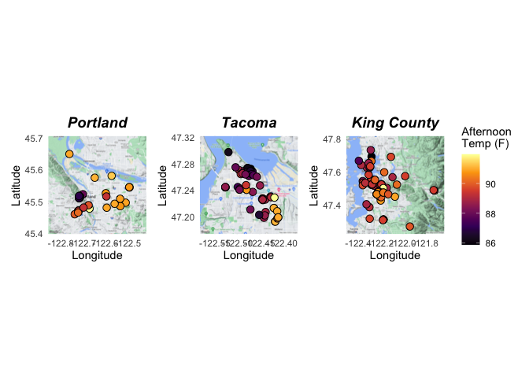<!-- -->


``` r
king.map <- king.map + theme(axis.title.x = element_blank(),axis.title.y = element_blank())
tacoma.map <- tacoma.map +theme(axis.title.y = element_blank(),axis.title.x = element_blank())
portland.map <- portland.map +theme(axis.title.x = element_blank())
portland.dead.top.map <- portland.dead.top.map + theme(plot.title = element_blank(),axis.title.x = element_blank()) 
portland.thinning.map <- portland.thinning.map + theme(legend.position = "none",plot.title = element_blank())
tacoma.dead.top.map <- tacoma.dead.top.map + theme(legend.position = "none",plot.title = element_blank(),axis.title.x = element_blank(),axis.title.y = element_blank())
tacoma.thinning.map <- tacoma.thinning.map + theme(legend.position = "none",plot.title = element_blank(),axis.title.y = element_blank())
king.dead.top.map <- king.dead.top.map + theme(plot.title = element_blank(),axis.title.x = element_blank(),axis.title.y = element_blank())
king.thinning.map <- king.thinning.map + theme(plot.title = element_blank(),axis.title.y = element_blank())
```


``` r
all.trees <- (portland.map + tacoma.map + king.map) + plot_annotation(title = 'All Trees') & theme(plot.title = element_text(hjust = 0.5))
dead.tops <- (portland.dead.top.map + tacoma.dead.top.map + king.dead.top.map) + plot_annotation(title = 'Trees with Dead Tops') & theme(plot.title = element_text(hjust = 0.5))
thin.trees <- (portland.thinning.map + tacoma.thinning.map + king.thinning.map) + plot_annotation(title = 'Trees with Thinning Canopies') & theme(plot.title = element_text(hjust = 0.5))
```


``` r
wrap_elements(all.trees) / wrap_elements(dead.tops) / wrap_elements(thin.trees)
```

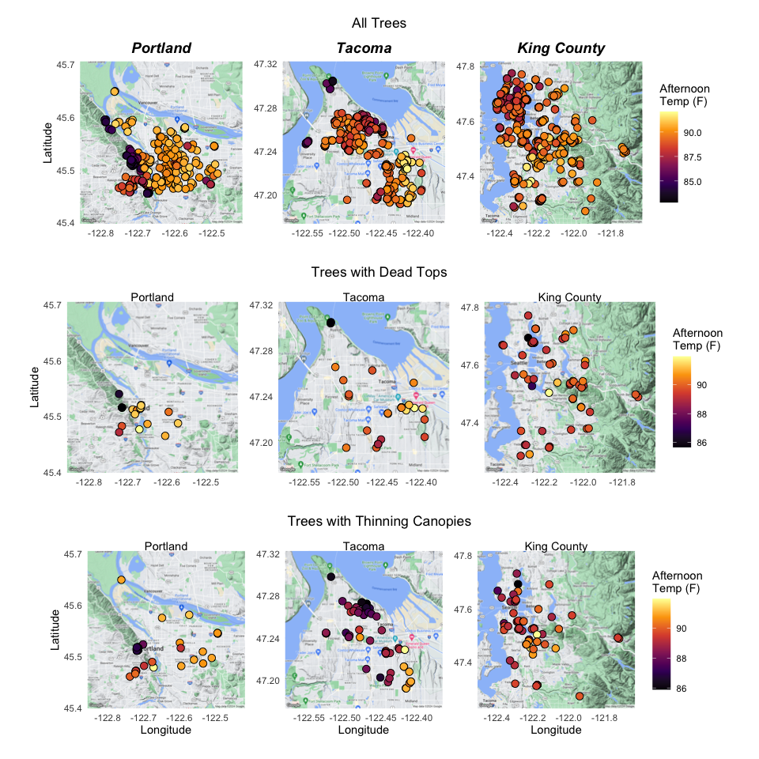<!-- -->


``` r
(portland.map + tacoma.map + king.map) / (portland.dead.top.map + tacoma.dead.top.map + king.dead.top.map) / (portland.thinning.map + tacoma.thinning.map + king.thinning.map)
```

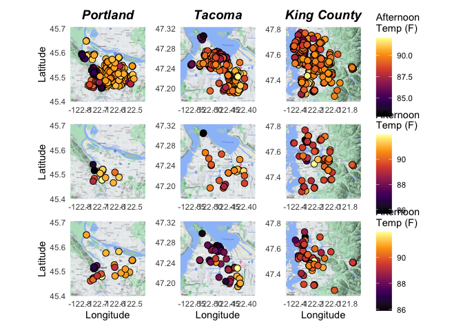<!-- -->


